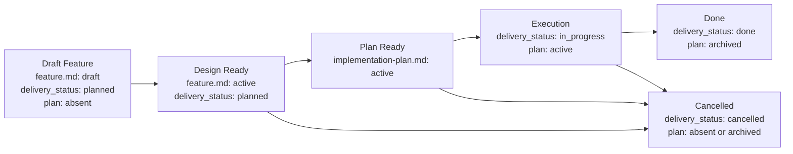

# Feature Flow

Этот документ задает порядок появления feature-артефактов. Агент должен вести feature package по стадиям и не создавать downstream-артефакты раньше, чем созрел их upstream-owner.

## Package Rules

1. Все документы одной фичи живут в `memory-bank/features/FT-XXX/`.
2. **Feature = vertical slice.** Одна фича — одна единица пользовательской ценности, пронизывающая все затронутые слои системы (UI, API, storage, infra). Горизонтальная нарезка ("все endpoints", "весь UI") допустима только для чисто инфраструктурных или рефакторинговых задач и должна быть явно обоснована через `NS-*`.
3. `feature.md` — canonical owner intent, delivery-scoped target outcome/KPI, design и verify для delivery-единицы.
4. `README.md` создается вместе с `feature.md` и остается routing-слоем на всем lifecycle.
5. `implementation-plan.md` — derived execution-документ. Он не должен существовать, пока sibling `feature.md` не стал design-ready.
6. Для canonical `feature.md`, feature-level `README.md` и `implementation-plan.md` используй wrapper-шаблоны из `memory-bank/flows/templates/feature/`: сам template-файл имеет `doc_function: template`, а frontmatter/body инстанцируемого документа живут внутри embedded template contract.
7. Смысл стабильных идентификаторов (`REQ-*`, `NS-*`, `CHK-*`, `STEP-*` и т.д.) задается в секции «Stable Identifiers» ниже.
8. Acceptance scenarios (`SC-*`) покрывают vertical slice end-to-end: от входного события до наблюдаемого результата через все затронутые слои. Тестирование отдельного слоя в изоляции допустимо как implementation detail плана, но не заменяет end-to-end acceptance.
9. **Связь с task tracker.** При создании feature package агент обязан добавить в исходную задачу или ticket ссылки на `feature.md` и, после появления, на `implementation-plan.md`. Это обеспечивает навигацию из task tracker к спецификации без ручного поиска по репозиторию.
10. Если фича является частью более крупной инициативы, `feature.md` может зависеть от PRD из `memory-bank/prd/`, но PRD не заменяет сам feature package.
11. Если фича создает новый устойчивый сценарий проекта или materially changes существующий, соответствующий `UC-*` в `memory-bank/use-cases/` должен быть создан или обновлен до closure.

## Выбор шаблона `feature.md`

`short.md` допустим только если одновременно выполняются все условия:

1. фичу можно описать через `REQ-*`, `NS-*`, максимум один `CON-*`, один `EC-*`, один `CHK-*` и один `EVID-*`;
2. в `feature.md` не нужны `ASM-*`, `DEC-*`, `CTR-*`, `FM-*`, rollout/backout-правила или ADR-dependent design rules;
3. изменение не вводит и не меняет API, event, schema, file format, CLI или env contract;
4. verify укладывается в один основной check без quality slices и без нескольких acceptance scenarios.

Если хотя бы одно условие нарушается, агент обязан выбрать или сделать upgrade до `large.md` до продолжения работы. Upgrade обязателен и в том случае, если фича стартовала как `short.md`, но по ходу работы потребовала `ASM-*`, `DEC-*`, `CTR-*`, `FM-*`, больше одного acceptance scenario или больше одного `CHK-*` / `EVID-*`.

## Lifecycle

## Transition Gates

Каждый gate — набор проверяемых предикатов. Переход допустим тогда и только тогда, когда все предикаты истинны.

### Bootstrap Feature Package

- [ ] `README.md` создан по шаблону `templates/feature/README.md`
- [ ] `feature.md` создан по шаблону `short.md` или `large.md`
- [ ] `implementation-plan.md` отсутствует

### Draft → Design Ready

- [ ] `feature.md` → `status: active`
- [ ] секция `What` содержит ≥ 1 `REQ-*` и ≥ 1 `NS-*`
- [ ] секция `Verify` содержит ≥ 1 `SC-*`
- [ ] каждый `REQ-*` прослеживается к ≥ 1 `SC-*` через traceability matrix
- [ ] секция `Verify` содержит ≥ 1 `CHK-*` и ≥ 1 `EVID-*`
- [ ] если deliverable нельзя принять без negative/edge coverage → ≥ 1 `NEG-*`

### Design Ready → Plan Ready

- [ ] агент выполнил grounding: прошёлся по текущему состоянию системы (relevant paths, existing patterns, dependencies) и зафиксировал результат в discovery context секции `implementation-plan.md`
- [ ] `implementation-plan.md` создан по шаблону `templates/feature/implementation-plan.md`
- [ ] `implementation-plan.md` → `status: active`
- [ ] `implementation-plan.md` содержит ≥ 1 `PRE-*`, ≥ 1 `STEP-*`, ≥ 1 `CHK-*`, ≥ 1 `EVID-*`
- [ ] discovery context в `implementation-plan.md` содержит: relevant paths, local reference patterns, unresolved questions (`OQ-*`), test surfaces и execution environment

### Plan Ready → Execution

- [ ] `feature.md` → `delivery_status: in_progress`
- [ ] `implementation-plan.md` → `status: active`
- [ ] `implementation-plan.md` фиксирует test strategy: automated coverage surfaces, required local/CI suites
- [ ] каждый manual-only gap имеет причину, ручную процедуру и `AG-*` с approval ref

### Execution → Done

- [ ] все `CHK-*` из `feature.md` имеют результат pass/fail в evidence
- [ ] все `EVID-*` из `feature.md` заполнены конкретными carriers (путь к файлу, CI run, screenshot)
- [ ] automated tests для change surface добавлены или обновлены
- [ ] required test suites зелёные локально и в CI
- [ ] каждый manual-only gap явно approved человеком (approval ref в `AG-*`)
- [ ] simplify review выполнен: код минимально сложен или complexity обоснована ссылкой на `CON-*`, `FM-*` или `DEC-*`
- [ ] если feature добавляет новый stable flow или materially changes существующий project-level scenario, соответствующий `UC-*` создан или обновлен и зарегистрирован в `memory-bank/use-cases/README.md`
- [ ] `feature.md` → `delivery_status: done`
- [ ] `implementation-plan.md` → `status: archived`

### → Cancelled (из любой стадии после Draft)

- [ ] `feature.md` → `delivery_status: cancelled`
- [ ] `implementation-plan.md` отсутствует ∨ `status: archived`

## Boundary Rules

1. `feature.md` обязан содержать секции `What`, `How`, `Verify`.
2. `Verify` в `feature.md` задает canonical test case inventory delivery-единицы: positive cases через `SC-*`, feature-specific negative coverage через `NEG-*` при необходимости, executable checks через `CHK-*` и evidence через `EVID-*`.
3. Если feature зависит от ADR, `feature.md` ссылается на соответствующий файл в `memory-bank/adr/` и учитывает его `decision_status`; `proposed` не считается finalized design.
4. Если feature зависит от канонического use case, `feature.md` ссылается на соответствующий файл в `memory-bank/use-cases/`. Use case остается owner-ом trigger/preconditions/main flow/postconditions на уровне проекта, а `feature.md` фиксирует только slice-specific реализацию.
5. `implementation-plan.md` остается derived execution-документом: он ссылается на canonical IDs из `feature.md` или ADR, фиксирует test strategy для исполнения, required local/CI suites и approval refs для manual-only gaps и не переопределяет scope, architecture, blockers, acceptance criteria или evidence contract.
6. Если меняются scope, architecture, acceptance criteria или evidence contract, сначала обновляется `feature.md` или ADR, потом downstream-план.
7. Если численный target threshold относится только к одной delivery-единице, canonical owner — соответствующий `feature.md`. Поднимать такой KPI в project-level документ можно только после того, как он стал shared upstream fact для нескольких feature.
8. Хороший `implementation-plan.md` начинается с discovery context: relevant paths, local reference patterns, unresolved questions, test surfaces и execution environment должны быть зафиксированы до sequencing изменений.
9. Для рискованных, необратимых или внешне-эффективных действий `implementation-plan.md` должен явно описывать human approval gates и не скрывать их внутри prose шага.

## Test Ownership Summary

Canonical testing policy живёт в [../engineering/testing-policy.md](../engineering/testing-policy.md). Ниже — выжимка, достаточная для создания feature package без обращения к policy-документу.

1. **Canonical test cases** delivery-единицы задаются в `feature.md` через `SC-*`, feature-specific `NEG-*`, `CHK-*` и `EVID-*`. `implementation-plan.md` владеет только стратегией исполнения: какие suites добавить, какие gaps временно manual-only и почему.
2. **Sufficient coverage** = покрыт основной changed behavior, новые или измененные contracts, критичные failure modes из `FM-*` и feature-specific negative/edge scenarios, если они меняют verdict. Процент line coverage сам по себе недостаточен.
3. **Manual-only допустим** только как явное исключение (live infra, hardware, недетерминированная среда). Для каждого gap — причина, ручная процедура или `EVID-*`, owner follow-up и approval ref через `AG-*`.
4. **К Design Ready** `feature.md` уже фиксирует test case inventory: минимум один `SC-*`, traceability к `REQ-*`. К `Done` — automated tests добавлены, обязательные suites зелёные локально и в CI.
5. **Simplify review** — отдельный проход после функциональных тестов, до closure. Цель: убедиться, что код минимально сложен. Три похожие строки лучше premature abstraction. Complexity оправдана только со ссылкой на `CON-*`, `FM-*` или `DEC-*`.
6. **Verification context separation** — функциональная верификация, simplify review и acceptance test — три логически отдельных прохода. Между проходами агент формулирует выводы до начала следующего. Для short features допустимо в одной сессии, но simplify review не пропускается.

## Stable Identifiers

### Feature IDs

| Prefix | Meaning | Used in |
| --- | --- | --- |
| `MET-*` | outcome-метрики | `feature.md` |
| `REQ-*` | scope и обязательные capability | `feature.md` |
| `NS-*` | non-scope | `feature.md` |
| `ASM-*` | assumptions и рабочие предпосылки | `feature.md` |
| `CON-*` | ограничения | `feature.md` |
| `DEC-*` | blocking decisions | `feature.md` |
| `NT-*` | do-not-touch / explicit change boundaries | `feature.md` |
| `INV-*` | инварианты | `feature.md` |
| `CTR-*` | контракты | `feature.md` |
| `FM-*` | failure modes | `feature.md` |
| `RB-*` | rollout / backout stages | `feature.md` |
| `EC-*` | exit criteria | `feature.md` |
| `SC-*` | acceptance scenarios | `feature.md` |
| `NEG-*` | negative / edge test cases | `feature.md` |
| `CHK-*` | проверки | `feature.md`, `implementation-plan.md` |
| `EVID-*` | evidence-артефакты | `feature.md`, `implementation-plan.md` |
| `RJ-*` | rejection rules | `feature.md`, `implementation-plan.md` |

### Plan IDs

| Prefix | Meaning | Used in |
| --- | --- | --- |
| `PRE-*` | preconditions | `implementation-plan.md` |
| `OQ-*` | unresolved questions / ambiguities | `implementation-plan.md` |
| `WS-*` | workstreams | `implementation-plan.md` |
| `AG-*` | approval gates for risky actions | `implementation-plan.md` |
| `STEP-*` | атомарные шаги | `implementation-plan.md` |
| `PAR-*` | параллелизуемые блоки | `implementation-plan.md` |
| `CP-*` | checkpoints | `implementation-plan.md` |
| `ER-*` | execution risks | `implementation-plan.md` |
| `STOP-*` | stop conditions / fallback | `implementation-plan.md` |

### Required Minimum

1. Любой canonical `feature.md` использует как минимум `REQ-*`, `NS-*`, `SC-*`, `CHK-*`, `EVID-*`.
2. Любой `feature.md` со `status: active` задает хотя бы один explicit test case через `SC-*`.
3. Short feature дополнительно допускает только минимальный набор, описанный в `memory-bank/flows/templates/feature/short.md`.
4. Large feature может использовать расширенный набор feature IDs по необходимости.
5. Любой `implementation-plan.md` использует как минимум `PRE-*`, `STEP-*`, `CHK-*`, `EVID-*`; при наличии ambiguity или human approval gates используются `OQ-*` и `AG-*`.

### Traceability Contract

1. Scope в `feature.md` фиксируется через `REQ-*`, non-scope через `NS-*`.
2. Verify в `feature.md` связывает `REQ-*` с test cases через `Acceptance Scenarios`, feature-specific `NEG-*`, `Traceability matrix`, `Test matrix` и `Evidence contract`.
3. `implementation-plan.md` ссылается на canonical IDs из `feature.md` в колонках `Implements`, `Verifies` и `Evidence IDs`.
4. Если sequencing блокируется неизвестностью, план фиксирует её как `OQ-*`, а не прячет в prose.
5. Если выполнение требует человеческого подтверждения для рискованных действий, план фиксирует это через `AG-*`.
6. Если ID начинает использоваться как стабильная сущность, его смысл должен быть совместим с этим документом.
