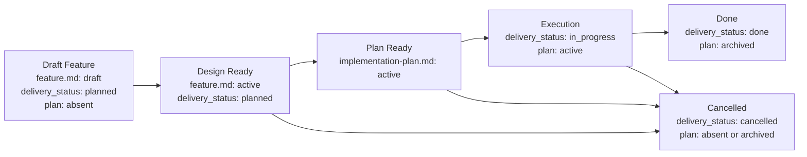
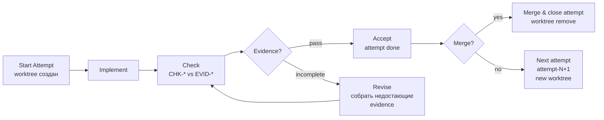

# Feature Flow

Этот документ задает порядок появления feature-артефактов. Агент должен вести feature package по стадиям и не создавать downstream-артефакты раньше, чем созрел их upstream-owner.

## Package Rules

1. Все документы одной фичи живут в `memory-bank/features/FT-XXX/`.
2. **Feature = vertical slice.** Одна фича — одна единица пользовательской ценности, пронизывающая все затронутые слои системы (UI, API, storage, infra). Горизонтальная нарезка ("все endpoints", "весь UI") допустима только для чисто инфраструктурных или рефакторинговых задач и должна быть явно обоснована через `NS-*`.
3. `feature.md` — canonical owner intent, delivery-scoped target outcome/KPI, design и verify для delivery-единицы.
4. `README.md` создается вместе с `feature.md` и остается routing-слоем на всем lifecycle.
5. `implementation-plan.md` — derived execution-документ. Он не должен существовать, пока sibling `feature.md` не стал design-ready.
6. Для canonical `feature.md`, feature-level `README.md` и `implementation-plan.md` используй wrapper-шаблоны из `memory-bank/flows/templates/feature/`: сам template-файл имеет `doc_function: template`, а frontmatter/body инстанцируемого документа живут внутри embedded template contract.
7. Смысл стабильных идентификаторов (`REQ-*`, `NS-*`, `CHK-*`, `STEP-*` и т.д.) задается в секции «Stable Identifiers» ниже.
8. Acceptance scenarios (`SC-*`) покрывают vertical slice end-to-end: от входного события до наблюдаемого результата через все затронутые слои. Тестирование отдельного слоя в изоляции допустимо как implementation detail плана, но не заменяет end-to-end acceptance.
9. **Связь с task tracker.** При создании feature package агент обязан добавить в исходную задачу или ticket ссылки на `feature.md` и, после появления, на `implementation-plan.md`. Это обеспечивает навигацию из task tracker к спецификации без ручного поиска по репозиторию.
10. Если фича является частью более крупной инициативы, `feature.md` может зависеть от PRD из `memory-bank/prd/`, но PRD не заменяет сам feature package.
11. Если фича создает новый устойчивый сценарий проекта или materially changes существующий, соответствующий `UC-*` в `memory-bank/use-cases/` должен быть создан или обновлен до closure.
12. Если фича вводит новые доменные или архитектурные термины (сущности, паттерны, внешние концепции), соответствующие записи в `memory-bank/glossary.md` должны быть добавлены или обновлены к моменту Design Ready. Агент проверяет glossary при создании `feature.md` и пополняет его при появлении новых терминов в ходе работы.

## Выбор шаблона `feature.md`

`short.md` допустим только если одновременно выполняются все условия:

1. фичу можно описать через `REQ-*`, `NS-*`, максимум один `CON-*`, один `EC-*`, один `CHK-*` и один `EVID-*`;
2. в `feature.md` не нужны `ASM-*`, `DEC-*`, `CTR-*`, `FM-*`, rollout/backout-правила или ADR-dependent design rules;
3. изменение не вводит и не меняет API, event, schema, file format, CLI или env contract;
4. verify укладывается в один основной check без quality slices и без нескольких acceptance scenarios.

Если хотя бы одно условие нарушается, агент обязан выбрать или сделать upgrade до `large.md` до продолжения работы. Upgrade обязателен и в том случае, если фича стартовала как `short.md`, но по ходу работы потребовала `ASM-*`, `DEC-*`, `CTR-*`, `FM-*`, больше одного acceptance scenario или больше одного `CHK-*` / `EVID-*`.

## Lifecycle

## Resume / Continue Work — ОБЯЗАТЕЛЬНЫЙ ВХОД

Когда получена задача «продолжи работу над фичей N» или любая задача, связанная с реализацией существующей фичи:

1. Прочитай `feature.md` → проверь `delivery_status`
2. Найди соответствующую строку в таблице ниже и **полностью выполни все gate-предикаты** из указанного раздела перед любым write-действием (создание файлов, запуск команд, редактирование кода)

| `delivery_status` | Наличие `implementation-plan.md` | Где искать gates | Первый обязательный шаг |
|---|---|---|---|
| `planned` | отсутствует | Design Ready → Plan Ready | Grounding + создать eval suite + создать `implementation-plan.md` |
| `planned` | присутствует | **Plan Ready → Execution** | Проверить eval suite → создать worktree через `EnterWorktree` → создать attempt |
| `in_progress` | присутствует | Execution (внутри worktree) | Прочитать impl-plan → найти первый незакрытый `STEP-*` → продолжить в worktree |
| `done` / `cancelled` | любое | — | Сообщить пользователю, уточнить задачу |

> **Запрещено:** начинать писать код, создавать файлы кода или запускать миграции до тех пор, пока все gate-предикаты соответствующего раздела не проверены и не выполнены.

## Transition Gates

Каждый gate — набор проверяемых предикатов. Переход допустим тогда и только тогда, когда все предикаты истинны.

### Orchestration Patterns

Перед стартом первого attempt агент обязан выбрать один из трёх паттернов и зафиксировать выбор в `meta.yaml` attempt-а.

| Pattern | Когда использовать | Признаки |
|---|---|---|
| `sequential` | **Default.** Workstreams зависят друг от друга, один агент, один worktree | PAR-* блоков нет или они малы; merge-конфликты вероятны при параллельной работе |
| `parallel` | Независимые workstreams, выигрыш по времени оправдывает merge-усилие | ≥ 2 явных PAR-* с непересекающимся change surface; каждый WS завершён атомарно и может быть review-рован независимо |
| `delegated` | Шаг требует специализированного агента или capability, которой нет у основного агента | Шаг — `/layers:review`, `/spec-review`, поиск по большой кодовой базе, eval-runner |

**Parallel worktree rule:** переход в `parallel` допустим только если:
1. PAR-* workstreams явно объявлены в `implementation-plan.md`
2. Change surface не пересекается (разные файлы)
3. Merge strategy зафиксирована в `meta.yaml` до старта второго worktree

### Attempt Lifecycle

Каждый attempt — первая попытка реализации может иметь несколько итераций:

Правила:
- Каждый attempt создаётся в отдельном `git worktree` (через `EnterWorktree`, если такой wrapper доступен; иначе через `git worktree add -b ...`). Простая смена ветки через `git checkout -b` не считается изоляцией attempt-а.
- После accept/merge: worktree удаляется
- Evidence (`EVID-*`) обязательна для каждого `CHK-*` перед переходом к следующей попытке
- После 3 неудачных attempts — эскалация ("loop detected → upstream problem")

## Eval Layer

Eval — отдельный слой верификации, живёт в `feature/eval/` и запускается при Design Ready и перед Done.

### Eval для фичи

| Слой | Проверяет | Evidence | Авто? |
|-------|-----------|----------|--------|
| 1. Гигиена | lint, typecheck, build | ✅ |
| 2. Plan coverage | REQ-* → STEP-* | ⚠️ subagent |
| 3. Acceptance | CHK-* → EVID-* | ⚠️ mixed |
| 4. Workflow | trajectory, пропущенные шаги | ⚠️ evaluator |
| 5. Data integrity | card/word mapping, migrations | ❌ manual |

### Eval Suite

Минимальный набор тестовых кейсов создаётся автоматически при Design Ready:

- `eval/suite/happy-path.md` — основной сценарий
- `eval/suite/edge-cases.md` — граничные случаи
- `eval/suite/regression.md` — проверка на регрессию

Запуск: `/eval:run` command → evaluator agent executes suite → decision (accept/revise/escalate/split).

Decision predicates:
- `accept` — все critical eval cases pass, required `CHK-*` и `EVID-*` закрыты concrete carriers.
- `revise` — failure локален, scope не меняется, исправление укладывается в текущий attempt/revise loop.
- `escalate` — critical regression, missing mandatory evidence после допустимых revise-итераций или нужен human architectural decision.
- `split` — execution/eval выявил независимый scope growth: продолжение требует нового feature package или разделения release risk.

### New Feature Request — ОБЯЗАТЕЛЬНЫЙ ВХОД

Когда получена задача «начнём следующую фичу», «давай сделаем X», «работаем над FT-XXX из PRD-YYY» или любой запрос на создание новой фичи — агент обязан пройти через brief phase. **Запрещено** сразу создавать GitHub Issue, feature package или писать код.

#### Шаг 1: Обсуждение проблемы

Агент задаёт уточняющие вопросы по четырём осям (проблема / для кого / откуда / что хотим). Если upstream PRD существует — агент читает его и domain контекст, затем обсуждает feature-specific delta.

Агент **не предлагает решение** на этом этапе. Brief — только проблема и намерение.

#### Шаг 2: Создание transient brief draft

Агент создаёт transient draft по шаблону [`templates/feature/brief.md`](templates/feature/brief.md) в чате, `/tmp` или issue draft. Persistent `memory-bank/features/FT-XXX/brief.md` не создаётся. Brief содержит 4 секции: Проблема / Для кого / Происхождение / Желаемый результат.

#### Шаг 3: Ревью transient brief draft через субагент

Агент запускает ревью transient brief draft через **отдельный субагент** (`model: opus`). Ревью проверяет 5 критериев (подробнее в `templates/feature/brief.md` → секция «Ревью брифа»):

1. Проблема конкретна и измерима
2. Назван стейкхолдер
3. Понятен контекст
4. Brief НЕ содержит решения
5. Нет двусмысленных формулировок

Для каждого критерия — явный PASS/FAIL с цитатой и предложением. **Самопроверка недопустима** — только отдельный субагент.

#### Шаг 4: Исправление и повтор ревью

Если есть замечания — агент исправляет transient brief draft и повторяет ревью (шаг 3). Цикл продолжается до «0 замечаний».

#### Шаг 5: Создание GitHub Issue

Только после «0 замечаний, Brief готов к работе» — агент создаёт GitHub Issue с текстом brief.

#### Шаг 6: Удаление transient draft

Агент удаляет transient draft, если он был создан как файл. GitHub Issue остаётся единственным durable source of truth для brief.

#### Шаг 7: STOP-gate

Агент сообщает номер issue и предлагает начать новую сессию с Opus для bootstrapping:

> Issue #XXX создан. Для bootstrapping feature package начни новую сессию командой `/model opus` (или `claude --model opus-4-6`).

**Override:** Если пользователь явно запросил продолжение в текущей сессии (например, «делай просто сабагентом»), STOP-gate снимается. Агент использует subagent с Opus для bootstrapping.

#### Шаг 8: Bootstrap feature package

В новой сессии (или через subagent при override) — агент bootstraps: `README.md` + `feature.md` (draft).

### Bootstrap Feature Package

**Предшествует bootstrap:** brief phase пройден (шаги 1–7 выше). GitHub Issue создан с «0 замечаний» по brief review. Номер issue становится XXX в имени пакета `FT-XXX/`.

- [ ] Brief phase пройдена: transient brief draft → ревью → 0 замечаний → GitHub Issue → transient draft удалён, если был файлом
- [ ] GitHub Issue создан, номер известен
- [ ] `README.md` создан по шаблону `templates/feature/README.md`
- [ ] `feature.md` создан по шаблону `short.md` или `large.md`
- [ ] `implementation-plan.md` отсутствует

### Draft → Design Ready

- [ ] `feature.md` → `status: active`
- [ ] секция `What` содержит ≥ 1 `REQ-*` и ≥ 1 `NS-*`
- [ ] секция `Verify` содержит ≥ 1 `SC-*`
- [ ] каждый `REQ-*` прослеживается к ≥ 1 `SC-*` через traceability matrix
- [ ] секция `Verify` содержит ≥ 1 `CHK-*` и ≥ 1 `EVID-*`
- [ ] если deliverable нельзя принять без negative/edge coverage → ≥ 1 `NEG-*`
- [ ] новые доменные или архитектурные термины добавлены в `memory-bank/glossary.md`

### Design Ready → Plan Ready

- [ ] агент выполнил grounding: прошёлся по текущему состоянию системы (relevant paths, existing patterns, dependencies) и зафиксировал результат в discovery context секции `implementation-plan.md`
- [ ] eval suite создан: `eval/suite/happy-path.md`, `eval/suite/edge-cases.md`, `eval/suite/regression.md` (минимальный набор тестовых кейсов по `SC-*` и `NEG-*` из `feature.md`)
- [ ] `implementation-plan.md` создан по шаблону `templates/feature/implementation-plan.md`
- [ ] `implementation-plan.md` → `status: active`
- [ ] `implementation-plan.md` содержит ≥ 1 `PRE-*`, ≥ 1 `STEP-*`, ≥ 1 `CHK-*`, ≥ 1 `EVID-*`
- [ ] discovery context в `implementation-plan.md` содержит: relevant paths, local reference patterns, unresolved questions (`OQ-*`), test surfaces и execution environment

### Plan Ready → Execution

- [ ] eval suite существует: `eval/suite/happy-path.md`, `eval/suite/edge-cases.md`, `eval/suite/regression.md` — **обязательная проверка перед любым write-действием**; если не создан — создать сейчас, до кода
- [ ] eval criteria объявлены: для каждого `CHK-*` зафиксировано что считается pass — **до написания кода**
- [ ] evidence pre-declaration заполнена в `implementation-plan.md`: ожидаемые `EVID-*` с путями и producing steps — **до написания кода**
- [ ] orchestration pattern выбран (`sequential` / `parallel` / `delegated`) и зафиксирован в `implementation-plan.md` → Orchestration Pattern секция
- [ ] Human Control Map заполнена в `implementation-plan.md` (или явно `none — fully autonomous`)
- [ ] worktree создан через `EnterWorktree` или `git worktree add -b ...` — **не через `git checkout -b`**; worktree создаёт изолированную копию репозитория, простая ветка этого не обеспечивает
- [ ] `attempts/attempt-1/meta.yaml` создан с `orchestration.*` и `human_control_points`; pre-attempt checklist в `start.md` отмечен
- [ ] `feature.md` → `delivery_status: in_progress`
- [ ] `implementation-plan.md` → `status: active`
- [ ] `implementation-plan.md` фиксирует test strategy: automated coverage surfaces, required local/CI suites
- [ ] каждый manual-only gap имеет причину, ручную процедуру и `AG-*` с approval ref

### Execution → Done

- [ ] **Eval suite выполнена:** `/eval:run` для этой фичи возвращает `accept` — **обязательное условие до closure**
- [ ] все `CHK-*` из `feature.md` имеют результат pass/fail в evidence
- [ ] все `EVID-*` из `feature.md` заполнены конкретными carriers (путь к файлу, CI run, screenshot)
- [ ] automated tests для change surface добавлены или обновлены
- [ ] required test suites зелёные локально и в CI
- [ ] каждый manual-only gap явно approved человеком (approval ref в `AG-*`)
- [ ] **Layered Rails: `/layers:review`** выполнен на всех новых/изменённых файлах, критических нарушений архитектурных границ нет. **Exception:** если change surface затрагивает только views/CSS/config — шаг пропускается с пометкой `N/A: no layered code in change surface`
- [ ] simplify review выполнен: код минимально сложен или complexity обоснована ссылкой на `CON-*`, `FM-*` или `DEC-*`
- [ ] если feature добавляет новый stable flow или materially changes существующий project-level scenario, соответствующий `UC-*` создан или обновлен и зарегистрирован в `memory-bank/use-cases/README.md`
- [ ] `feature.md` → `delivery_status: done`
- [ ] `implementation-plan.md` → `status: archived`

### → Cancelled (из любой стадии после Draft)

- [ ] `feature.md` → `delivery_status: cancelled`
- [ ] `implementation-plan.md` отсутствует ∨ `status: archived`

## Boundary Rules

1. `feature.md` обязан содержать секции `What`, `How`, `Verify`.
2. `Verify` в `feature.md` задает canonical test case inventory delivery-единицы: positive cases через `SC-*`, feature-specific negative coverage через `NEG-*` при необходимости, executable checks через `CHK-*` и evidence через `EVID-*`.
3. Если feature зависит от ADR, `feature.md` ссылается на соответствующий файл в `memory-bank/adr/` и учитывает его `decision_status`; `proposed` не считается finalized design.
4. Если feature зависит от канонического use case, `feature.md` ссылается на соответствующий файл в `memory-bank/use-cases/`. Use case остается owner-ом trigger/preconditions/main flow/postconditions на уровне проекта, а `feature.md` фиксирует только slice-specific реализацию.
5. `implementation-plan.md` остается derived execution-документом: он ссылается на canonical IDs из `feature.md` или ADR, фиксирует test strategy для исполнения, required local/CI suites и approval refs для manual-only gaps и не переопределяет scope, architecture, blockers, acceptance criteria или evidence contract.
6. Если меняются scope, architecture, acceptance criteria или evidence contract, сначала обновляется `feature.md` или ADR, потом downstream-план.
7. Если численный target threshold относится только к одной delivery-единице, canonical owner — соответствующий `feature.md`. Поднимать такой KPI в project-level документ можно только после того, как он стал shared upstream fact для нескольких feature.
8. Хороший `implementation-plan.md` начинается с discovery context: relevant paths, local reference patterns, unresolved questions, test surfaces и execution environment должны быть зафиксированы до sequencing изменений.
9. Для рискованных, необратимых или внешне-эффективных действий `implementation-plan.md` должен явно описывать human approval gates и не скрывать их внутри prose шага.

## Test Ownership Summary

Canonical testing policy живёт в [../engineering/testing-policy.md](../engineering/testing-policy.md). Ниже — выжимка, достаточная для создания feature package без обращения к policy-документу.

1. **Canonical test cases** delivery-единицы задаются в `feature.md` через `SC-*`, feature-specific `NEG-*`, `CHK-*` и `EVID-*`. `implementation-plan.md` владеет только стратегией исполнения: какие suites добавить, какие gaps временно manual-only и почему.
2. **Sufficient coverage** = покрыт основной changed behavior, новые или измененные contracts, критичные failure modes из `FM-*` и feature-specific negative/edge scenarios, если они меняют verdict. Процент line coverage сам по себе недостаточен.
3. **Manual-only допустим** только как явное исключение (live infra, hardware, недетерминированная среда). Для каждого gap — причина, ручная процедура или `EVID-*`, owner follow-up и approval ref через `AG-*`.
4. **К Design Ready** `feature.md` уже фиксирует test case inventory: минимум один `SC-*`, traceability к `REQ-*`. К `Done` — automated tests добавлены, обязательные suites зелёные локально и в CI.
5. **Layered Rails проверки** — обязательная часть процесса: `/layers:review` после реализации (Execution → Done) для проверки архитектурных границ.
6. **Simplify review** — отдельный проход после функциональных тестов, до closure. Цель: убедиться, что код минимально сложен. Три похожие строки лучше premature abstraction. Complexity оправдана только со ссылкой на `CON-*`, `FM-*` или `DEC-*`.
7. **Verification context separation** — функциональная верификация, Layered Rails review, simplify review и acceptance test — логически отдельных прохода. Между проходами агент формулирует выводы до начала следующего. Для short features допустимо в одной сессии, но ни один из проходов не пропускается.

## Stable Identifiers

### Feature IDs

| Prefix   | Meaning                                   | Used in                                |
| -------- | ----------------------------------------- | -------------------------------------- |
| `MET-*`  | outcome-метрики                           | `feature.md`                           |
| `REQ-*`  | scope и обязательные capability           | `feature.md`                           |
| `NS-*`   | non-scope                                 | `feature.md`                           |
| `ASM-*`  | assumptions и рабочие предпосылки         | `feature.md`                           |
| `CON-*`  | ограничения                               | `feature.md`                           |
| `DEC-*`  | blocking decisions                        | `feature.md`                           |
| `NT-*`   | do-not-touch / explicit change boundaries | `feature.md`                           |
| `INV-*`  | инварианты                                | `feature.md`                           |
| `CTR-*`  | контракты                                 | `feature.md`                           |
| `FM-*`   | failure modes                             | `feature.md`                           |
| `RB-*`   | rollout / backout stages                  | `feature.md`                           |
| `EC-*`   | exit criteria                             | `feature.md`                           |
| `SC-*`   | acceptance scenarios                      | `feature.md`                           |
| `NEG-*`  | negative / edge test cases                | `feature.md`                           |
| `CHK-*`  | проверки                                  | `feature.md`, `implementation-plan.md` |
| `EVID-*` | evidence-артефакты                        | `feature.md`, `implementation-plan.md` |
| `RJ-*`   | rejection rules                           | `feature.md`, `implementation-plan.md` |

### Plan IDs

| Prefix | Meaning | Used in |
| --- | --- | --- |
| `PRE-*` | preconditions | `implementation-plan.md` |
| `OQ-*` | unresolved questions / ambiguities | `implementation-plan.md` |
| `WS-*` | workstreams | `implementation-plan.md` |
| `AG-*` | approval gates for risky actions | `implementation-plan.md` |
| `STEP-*` | атомарные шаги | `implementation-plan.md` |
| `PAR-*` | параллелизуемые блоки | `implementation-plan.md` |
| `CP-*` | checkpoints | `implementation-plan.md` |
| `ER-*` | execution risks | `implementation-plan.md` |
| `STOP-*` | stop conditions / fallback | `implementation-plan.md` |

### Required Minimum

1. Любой canonical `feature.md` использует как минимум `REQ-*`, `NS-*`, `SC-*`, `CHK-*`, `EVID-*`.
2. Любой `feature.md` со `status: active` задает хотя бы один explicit test case через `SC-*`.
3. Short feature дополнительно допускает только минимальный набор, описанный в `memory-bank/flows/templates/feature/short.md`.
4. Large feature может использовать расширенный набор feature IDs по необходимости.
5. Любой `implementation-plan.md` использует как минимум `PRE-*`, `STEP-*`, `CHK-*`, `EVID-*`; при наличии ambiguity или human approval gates используются `OQ-*` и `AG-*`.

### Traceability Contract

1. Scope в `feature.md` фиксируется через `REQ-*`, non-scope через `NS-*`.
2. Verify в `feature.md` связывает `REQ-*` с test cases через `Acceptance Scenarios`, feature-specific `NEG-*`, `Traceability matrix`, `Test matrix` и `Evidence contract`.
3. `implementation-plan.md` ссылается на canonical IDs из `feature.md` в колонках `Implements`, `Verifies` и `Evidence IDs`.
4. Если sequencing блокируется неизвестностью, план фиксирует её как `OQ-*`, а не прячет в prose.
5. Если выполнение требует человеческого подтверждения для рискованных действий, план фиксирует это через `AG-*`.
6. Если ID начинает использоваться как стабильная сущность, его смысл должен быть совместим с этим документом.
